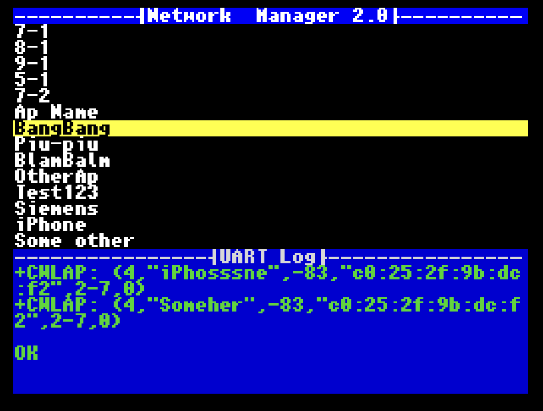
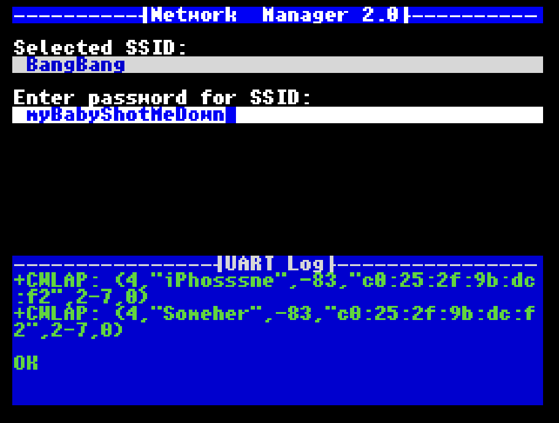

# WiFi Network manager for ZX Spectrum

New network manager for ZX Spectrum!

Currently supported ZXUno's and AY Wifi's, configuration stored on ESP module and old style esxDOS configuration file both(to keep compatibility with outdated software).

